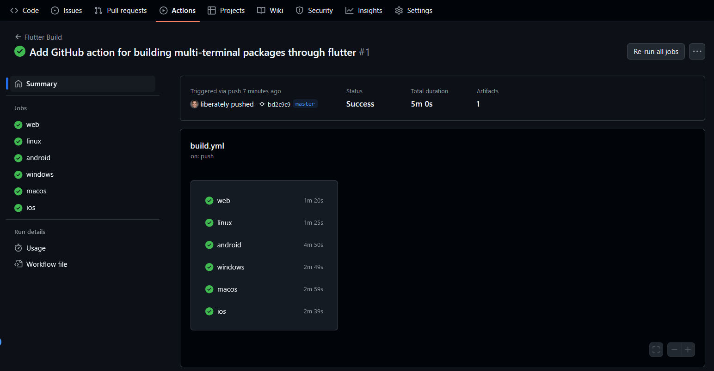

# Flutter-Github-Action-CI-Example

这是一个使用 GitHub Actions 和 Flutter 构建跨平台应用的示例项目。它展示了如何通过 GitHub Actions 自动化构建流程，支持 Windows、Linux、macOS、Android、iOS 和 Web 平台的应用打包。

---

## ✨ 功能

- 自动化构建：使用 GitHub Actions 实现多个平台的同时构建。🚀
- 支持多平台：支持 Android、iOS、Web、Windows、Linux 和 macOS。🌐
- 发布和分发：通过 GitHub Releases 发布构建产物。📦
- 灵活配置：可根据需求调整构建配置和环境。🔧

---

## 🎨 设计规范

- 使用 Flutter 进行跨平台开发，确保应用在多个平台上的一致性。🌈
- 按平台顺序进行构建：Android、iOS、Web、Windows、Linux 和 macOS。📋
- 遵循 GitHub Actions 的最佳实践，确保工作流的高效和可维护性。✨

---

## 📸 截图

---

## 🛠️ 使用方法

### 前提条件 ✅

1. 确保 Flutter 项目已正确配置。🛠️
2. 启用 GitHub Actions 功能。⚙️
3. 将仓库的 `Workflow permissions` 配置为 `Read and write permissions`，路径为：`Settings` > `Code and automation` > `Action` > `General`。🔑
4. 针对 iOS 和 Android 平台，妥善配置所需的证书和密钥。📄

### 工作流配置 📝

在 Flutter 项目的根目录下创建 `.github/workflows/build.yml` 文件，并添加以下配置内容：

[raw](./.github/workflows/build.yml)

### 构建步骤 🛠️

1. **签出代码**：从 GitHub 仓库提取代码。📥
2. **设置 Flutter 环境**：安装项目指定的 Flutter 版本。🚀
3. **安装依赖项**：运行 `flutter pub get` 以安装项目的必要依赖。📦
4. **生成发布包**：按以下顺序依次构建 Android、iOS、Web、Windows、Linux 和 macOS 平台的发布包。🌍

### 使用说明 📌

1. 将上述配置文件 `build.yml` 添加至 GitHub 仓库中。🗂️
2. 每当提交带标签的代码时，GitHub Actions 将自动启动构建流程。🔄
3. 构建完成后，可在 GitHub Actions 面板中查看构建日志，并下载生成的二进制文件。📊

---

## ❓常见问题

Q1: 如何修改 Flutter 版本？  
A1: 可以在 `.github/workflows/build.yml` 中更改 `flutter-version` 的值。  

Q2: 如何添加新的平台？  
A2: 在工作流文件中添加相应的构建步骤，并安装所需的依赖。  

Q3: 构建失败怎么办？  
A3: 查看 GitHub Actions 面板中的构建日志，检查具体错误并修复相关问题。  

---

## 🤝 贡献

我们欢迎任何形式的社区贡献！  
请阅读 [贡献指南 (CONTRIBUTING.md)](CONTRIBUTING.md)，了解如何提交 Issue、请求功能或贡献代码。

---

## 📜 许可证

本项目遵循 [GPL-3.0 License](LICENSE)。

---

## 🙏 致谢

- [subosito/flutter-action](https://github.com/subosito/flutter-action)
- [actions/checkout](https://github.com/actions/checkout)
- [actions/upload-artifact](https://github.com/actions/upload-artifact)
- [actions/setup-java](https://github.com/actions/setup-java)
- [softprops/action-gh-release](https://github.com/softprops/action-gh-release)

## 📢 法律声明

本开源项目仅供个人技术学习与参考。由于可能涉及专利或版权相关内容，请在使用前确保已充分理解相关法律法规。未经授权，**请勿将本工具用于商业用途或进行任何形式的传播**。

本项目的所有代码和相关内容仅供个人技术学习与参考，任何使用产生的法律责任由使用者自行承担。

感谢您的理解与支持。
